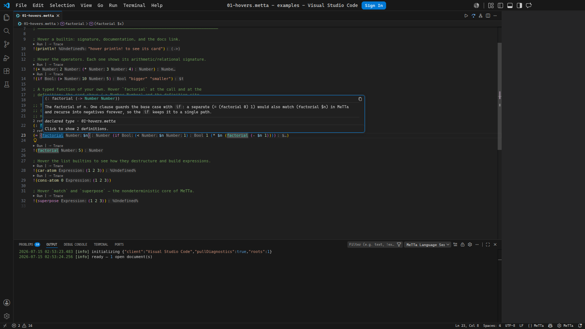
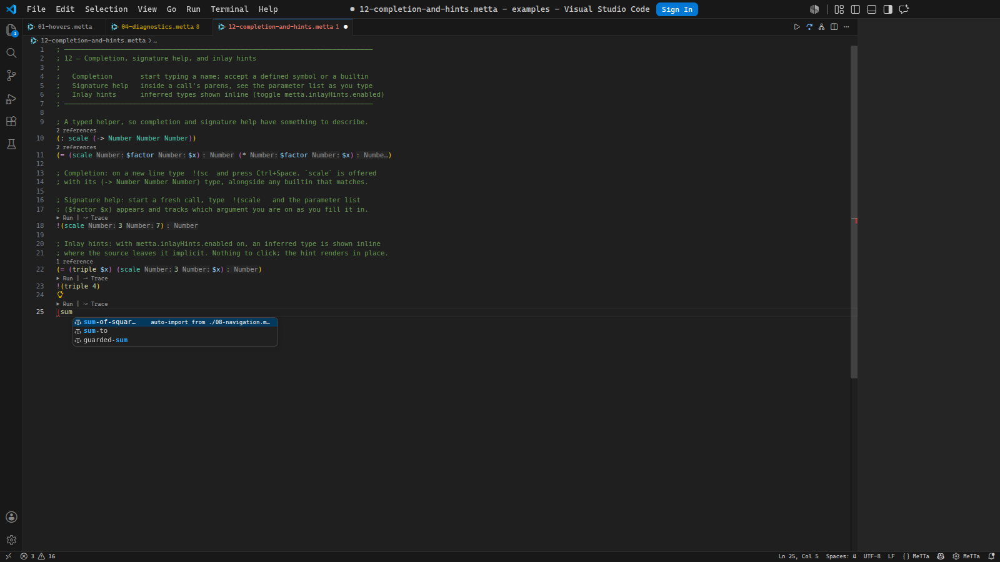
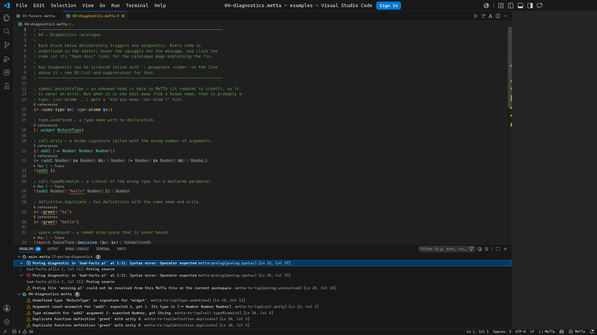
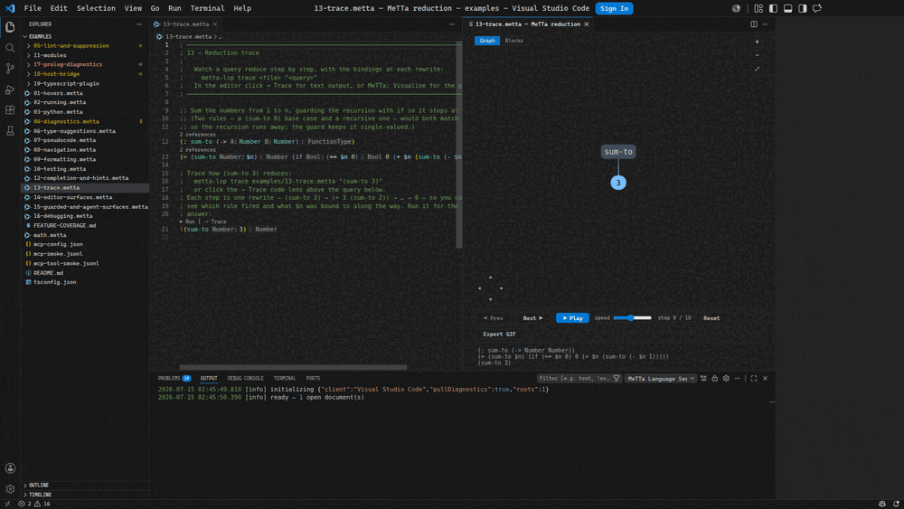
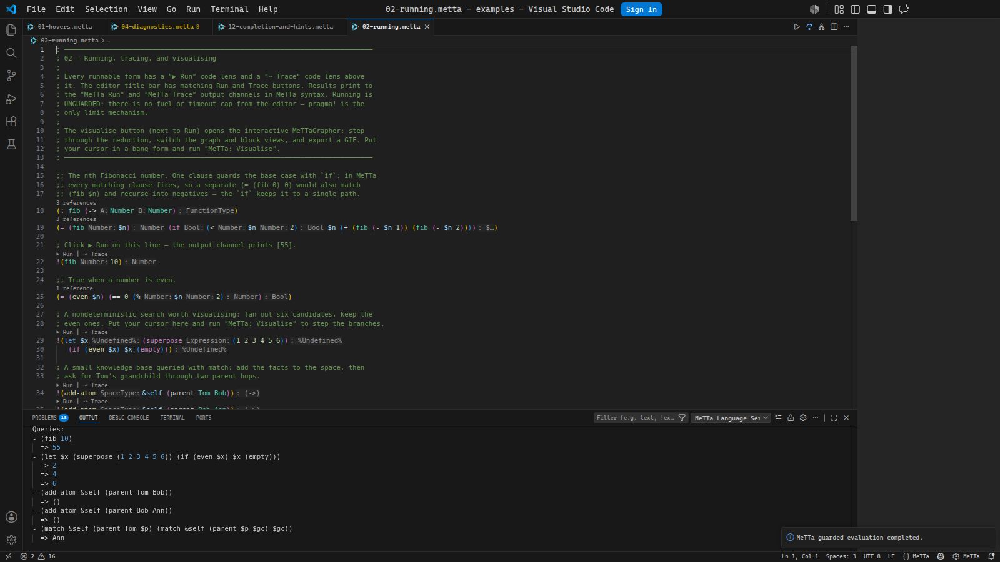
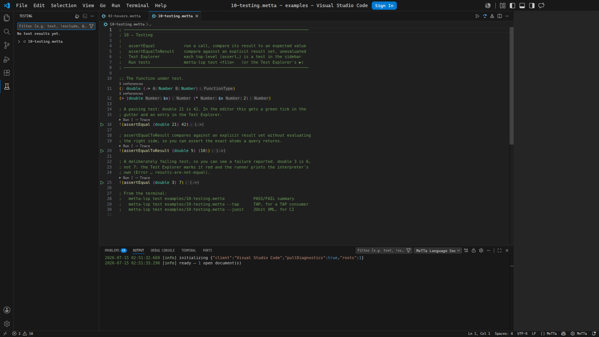

<div align="center">
  

  <h1>MeTTa LSP</h1>

  

  <p>
    <strong>
      A pure-TypeScript language server, VS Code extension, CLI, and MCP server
      for <a href="https://metta-lang.dev/">MeTTa</a>.
    </strong>
    <br />
    <sub>
      Hovers &nbsp;·&nbsp; Diagnostics &nbsp;·&nbsp; Run, trace &amp; visualise
      &nbsp;·&nbsp; Formatting &nbsp;·&nbsp; Debug adapter &nbsp;·&nbsp;
      Agent tools
    </sub>
  </p>

  <p>
    
    
    
    
    
    
  </p>

  <p>
    <a href="https://mestto.github.io/MeTTa-LSP/">
      
    </a>
    &nbsp;
    <a href="#quick-start">
      
    </a>
    &nbsp;
    <a href="https://github.com/MesTTo/MeTTa-LSP/issues/new?template=bug_report.yml">
      
    </a>
    &nbsp;
    <a href="https://github.com/MesTTo/MeTTa-LSP/issues/new?template=feature_request.yml">
      
    </a>
  </p>
</div>


## What is MeTTa LSP

MeTTa LSP is one analyzer exposed through several tools. The same code powers
the VS Code extension, stdio LSP server, command-line interface, MCP server,
debug adapter, generated docs, and browser IDE. A symbol should mean the
same thing in hover, diagnostics, trace output, docs, and an agent tool call.

The [browser IDE](https://mestto.github.io/MeTTa-LSP/browser-ide) runs the same
language server in a Web Worker. It provides a persistent multi-file workspace,
live diagnostics, completion, hover, navigation, rename, formatting, document
symbols, and guarded evaluation without a backend service.

The runtime is built on `@metta-ts/core`, so the server runs on Node without a
WASM dependency. Editor analysis does not evaluate user code. Explicit run,
trace, test, and visualise commands use the configured runtime path and the
guarded worker where appropriate.

The extension, CLI, stdio language server, MCP server, and docs tooling are
designed for Linux, macOS, and Windows. Editor-specific setup differs, but every
client launches the same Node stdio server and reads the same `metta.*`
settings.


## Quick Start

Install the VS Code extension from the Marketplace:

```sh
code --install-extension MeTTaMesTTo.metta-ts-lsp
```

You can also install a downloaded GitHub release asset:

```sh
code --install-extension metta-ts-lsp-0.11.1.vsix
```

Build from this checkout when you want the CLI, MCP server, or another editor:

```sh
npm install
npm run compile
```

The build writes these entry points:

```text
dist/server/server.js              stdio language server
dist/cli/cli.js                    metta-lsp CLI
dist/mcp/server.js                 MCP server
dist/debug/mettaDebugAdapter.js    debug adapter
```

Try the CLI from the checkout:

```sh
npm --silent run cli -- check examples/04-diagnostics.metta
npm --silent run cli -- trace examples/13-trace.metta "(sum-to 3)" --max 8
```

Package the extension locally:

```sh
npm run package
code --install-extension metta-ts-lsp-*.vsix
```

Use any stdio LSP client with:

```sh
node /path/to/metta-ts-lsp/dist/server/server.js --stdio
```


## Features

### Editor intelligence

The server implements the expected LSP surfaces for `.metta` files: hover,
completion, completion resolve, signature help, diagnostics, document symbols,
workspace symbols, definition, references, implementation, type definition,
declaration, rename, prepare rename, document highlights, linked editing,
document links, folding ranges, selection ranges, semantic tokens, call
hierarchy, inlay hints, code lens, code actions, organize imports, full
formatting, range formatting, and on-type formatting.

The VS Code extension adds status bar controls, settings quick-pick, run and
trace buttons, Test Explorer integration for assert forms, and a launch
configuration for stepping through reductions with the debug adapter.

Hover any symbol for a rust-analyzer-style card: the signature, the type, where
it is defined, and a link to the definitions.

 Number Number) type, documentation, and a link to its two definitions" />

Completion offers workspace symbols and builtins as you type, and auto-imports
one from another module when you accept it.



### Diagnostics and lint

Diagnostics cover syntax errors, duplicate definitions, unresolved symbols,
undefined types, unbound spaces, arity mismatches, literal type mismatches,
project lint rules, TypeScript host-bridge checks, and read-only Prolog parser
diagnostics for referenced `.pl` bridge files.

Every diagnostic carries its rule code, so you can read the exact rule that
fired and suppress it by name.



Suppressions are visible by design. Inline comments such as
`; @suppress symbol.possibleTypo` hide one diagnostic and get hover text that
shows what they suppressed. Project suppressions live in `lint.metta` as data,
using the same structural matcher as lint rules.

### Run, test, trace, visualise

Visualise steps a query through its reduction as an interactive graph. Play it,
scrub it, or step one rewrite at a time, and switch between the graph and nested
blocks. Each frame is one settled reduction state, so you watch the term grow as
it recurses and collapse as it resolves.



Run commands evaluate top-level bang queries and print MeTTa syntax back to the
output channel or CLI.

 55, a superpose fanning to 2 4 6, and a match query resolving to Ann" />

Test discovery turns each top-level assert form into a Test Explorer entry with
an inline run button in the gutter. Trace records each reduction step for a
query, and visualise writes the interactive MeTTaGrapher view above.



Guarded evaluation runs in a stateless worker with fuel, timeout, output, and
stack limits. Unguarded run is available for trusted programs that intentionally
use host interop.

### Syntax and semantic colours

The TextMate grammar handles comments, strings, escapes, numbers, variables,
documentation atoms, parentheses, operators, declarations, and builtins.
Semantic tokens add meaning on top of the grammar for control flow, binding,
pattern matching, modules, type operators, evaluation, quote control, effects,
arithmetic, comparison, logic, math functions, collection functions, predicates,
assertions, declarations, definitions, return types, default-library symbols,
deprecated symbols, and unresolved symbols.

VS Code themes can style those token types directly. When a theme does not, the
extension maps them back to familiar TextMate scopes.

### TypeScript, Python, and Prolog surfaces

The TypeScript host bridge reads grounded operations registered from
`@metta-ts/hyperon` or the typed eDSL. Hover and go-to-definition on a grounded
atom can show the TypeScript signature, JSDoc, MeTTa type view, and host source.
The CLI exposes the same data with `host-type`.

The TypeScript language-service plugin gives MeTTa hover, completion, signature
help, and diagnostics inside MeTTa strings and templates in `.ts` files. Python
interop examples cover `py-atom`, `py-call`, and `py-eval`. Prolog diagnostics
parse referenced `.pl` files without consulting or executing them.

### Search, rewrite, and docs

The structural search command treats MeTTa forms as data. `$X` captures one atom
and `$$$Rest` captures a sequence. Regex constraints can refine captures in
`lint.metta`, and `replace` can preview or write structural rewrites.

The docs generator builds a MeTTa API reference from workspace modules and host
operations. Hovers, CLI output, generated reference pages, and the browser docs
site all share the same rendering code for MeTTa docs.


## Examples

Open `examples/` as the VS Code workspace and walk the files in order. Each file
shows one surface and includes comments for the editor action or CLI command to
try. The complete checklist lives in
[`examples/FEATURE-COVERAGE.md`](examples/FEATURE-COVERAGE.md).

| Example | Surface |
| --- | --- |
| [`01-hovers.metta`](examples/01-hovers.metta) | Hovers for builtins and user symbols |
| [`02-running.metta`](examples/02-running.metta) | Run, trace, and visualise |
| [`04-diagnostics.metta`](examples/04-diagnostics.metta) | Diagnostics catalogue |
| [`05-lint-and-suppression/`](examples/05-lint-and-suppression/demo.metta) | Lint rules, fixes, and suppression |
| [`08-navigation.metta`](examples/08-navigation.metta) | Definition, references, rename, and call hierarchy |
| [`09-formatting.metta`](examples/09-formatting.metta) | Full, range, and on-type formatting |
| [`10-testing.metta`](examples/10-testing.metta) | Assert tests and Test Explorer |
| [`13-trace.metta`](examples/13-trace.metta) | Reduction traces |
| [`14-editor-surfaces.metta`](examples/14-editor-surfaces.metta) | Semantic colours, symbols, links, folding, and selection ranges |
| [`15-guarded-and-agent-surfaces.metta`](examples/15-guarded-and-agent-surfaces.metta) | Guarded evaluation, CLI, and MCP |
| [`16-debugging.metta`](examples/16-debugging.metta) | Debug adapter |
| [`17-prolog-diagnostics/`](examples/17-prolog-diagnostics/main.metta) | Prolog parser diagnostics |
| [`18-host-bridge/`](examples/18-host-bridge/main.metta) | TypeScript grounded-operation host bridge |
| [`19-typescript-plugin/`](examples/19-typescript-plugin/sample.ts) | MeTTa inside TypeScript strings |


## Command Line

The installed command is `metta-lsp`, which is the normal interface for scripts,
CI, agents, and local shells:

```sh
metta-lsp check examples/04-diagnostics.metta
metta-lsp trace examples/13-trace.metta "(sum-to 3)" --max 8
```

From an unlinked checkout, use the npm alias:

```sh
npm --silent run cli -- check examples/04-diagnostics.metta
```

To install the command globally from a checkout, run:

```sh
npm run compile
npm link
```

| Command | What it does |
| --- | --- |
| `capabilities` | Prints the capability ledger and surface coverage. |
| `check <file> [--json] [--show-suppressed]` | Runs parser, analyzer, lint, bridge, and optional diagnostics. |
| `symbols <file> [--json]` | Prints the document outline. |
| `hover <file> <line> <character> [--json]` | Shows hover text at a 1-based editor position. |
| `def <file> <line> <character> [--json]` | Goes to the symbol definition. |
| `host-type <file> <line> <character> [--json]` | Shows TypeScript host signature data for a grounded atom. |
| `explain <file> <line> <character> [--json]` | Renders the current form as mixfix notation. |
| `refs <file> <line> <character> [--json]` | Finds references for the symbol at a position. |
| `fmt <file> [--check]` | Formats a MeTTa file or checks whether it is formatted. |
| `lint <file> [--json] [--fix]` | Runs syntactic lint rules and optionally applies fixes. |
| `search <file> "<pattern>" [--json]` | Runs the structural pattern matcher. |
| `replace <file> "<pattern>" "<template>" [--write]` | Previews or applies structural rewrites. |
| `test <file> [--json] [--tap] [--junit]` | Runs top-level assert forms under the guarded runtime. |
| `run <file> [--unguarded]` | Evaluates top-level bang queries. Use `--unguarded` only for trusted host interop. |
| `trace <file> "<query>" [--json] [--max N]` | Shows each reduction step for a query. |
| `visualise <file> "<query>" [--out file.html] [--block]` | Writes a reduction graph HTML view. |
| `doc [root] [--json] [--build] [--serve] [--open] [--port N] [--base PATH]` | Generates or serves MeTTa docs for a workspace. |
| `repl [file]` | Starts an interactive MeTTa REPL, optionally seeded with a file. |
| `lsp --stdio` | Starts the language server over stdio. |
| `mcp --stdio` | Starts the MCP server over stdio. |

Most read commands accept `--json` for scripts and agents.

### Suppression example

```metta
; @suppress symbol.possibleTypo
!(cdr-atomm 2)
```

Project suppression lives in `lint.metta`:

```metta
(suppress (legacy $$$) symbol.possibleTypo)
```

A custom rule can add a regex constraint:

```metta
(lint-rule capitalized-function-name
  (pattern (= ($Func $$$Args) $$$Body))
  (metavariable-regex $Func "^[A-Z]")
  (message "function {$Func} starts with a capital letter")
  (severity warn))
```

Check a file and include suppressed diagnostics:

```sh
metta-lsp check examples/05-lint-and-suppression/demo.metta --show-suppressed
```

### Trace example

```metta
(: sum-to (-> Number Number))
(= (sum-to $n) (if (== $n 0) 0 (+ $n (sum-to (- $n 1)))))
```

```sh
metta-lsp trace examples/13-trace.metta "(sum-to 3)" --max 8
```

```text
0  (sum-to 3)
1  (if (== 3 0) 0 (+ 3 (sum-to (- 3 1))))
2  (if False 0 (+ 3 (sum-to (- 3 1))))
3  (+ 3 (sum-to (- 3 1)))
4  (+ 3 (sum-to 2))
5  (+ 3 (if (== 2 0) 0 (+ 2 (sum-to (- 2 1)))))
6  (+ 3 (if False 0 (+ 2 (sum-to (- 2 1)))))
7  (+ 3 (+ 2 (sum-to (- 2 1))))
8  (+ 3 (+ 2 (sum-to 1)))
... truncated at 8 steps
```


## Agent Setup

Claude Code, Codex, and generic MCP clients use the MCP server:

```sh
npm run compile
npm run setup:mcp -- --claude --codex
```

The setup script registers `metta-lsp` as a stdio MCP server pointing at
`dist/mcp/server.js`. Agents can call granular tools such as `lsp_diagnostics`,
`lsp_hover`, `lsp_workspace_symbols`, and `lsp_guarded_evaluate`, or the
operation-dispatched `lsp` tool.

Run the setup script with no flags to print snippets:

```sh
npm run setup:mcp
```

Claude Code:

```sh
claude mcp add -s user metta-lsp -- node /path/to/metta-ts-lsp/dist/mcp/server.js
```

Codex, in `~/.codex/config.toml`:

```toml
[mcp_servers."metta-lsp"]
command = "node"
args = ["/path/to/metta-ts-lsp/dist/mcp/server.js"]
startup_timeout_sec = 120.0
```

Generic MCP client:

```json
{
  "mcpServers": {
    "metta-lsp": {
      "command": "node",
      "args": ["/path/to/metta-ts-lsp/dist/mcp/server.js"]
    }
  }
}
```

Agent responses are compact by default. Symbol, location, and call-hierarchy
results are grouped by file and use row arrays:

```json
{
  "fields": ["name", "kind", "line", "char"],
  "count": 2,
  "files": [{ "path": "math.metta", "rows": [["inc", "function", 3, 5]] }]
}
```

Pass `"resultFormat": "lsp"` when an agent needs raw LSP protocol objects.

### OmegaClaw

OmegaClaw exposes tools through its MeTTa `getSkills` catalogue, so it uses a
skill overlay rather than MCP client config:

```sh
npm run compile
npm run setup:omegaclaw -- /path/to/OmegaClaw-Core
```

The installer copies the MeTTa-LSP bridge files into the target OmegaClaw-Core
checkout, adds reversible managed blocks, and writes a receipt. The integration
files stay in this repository, and a user can apply the overlay to their own
OmegaClaw system rather than maintaining a separate OmegaClaw fork.

Remove the overlay with:

```sh
npm run setup:omegaclaw -- /path/to/OmegaClaw-Core --uninstall
```


## Editor Setup

VS Code users install the extension. Other editors launch the same stdio server:

```sh
node /path/to/metta-ts-lsp/dist/server/server.js --stdio
```

Use that command in Neovim, Helix, Emacs, Sublime Text, Kate, Zed, or any other
LSP client that supports stdio servers. Settings live under the `metta` section.
The server reads settings through `workspace/configuration`,
`workspace/didChangeConfiguration`, or `initializationOptions`, depending on the
client.

Common settings:

```json
{
  "metta.docs.baseUrl": "https://mestto.github.io/MeTTa-LSP/",
  "metta.inlayHints.enabled": true,
  "metta.pseudocode.enabled": false,
  "metta.diagnostics.semanticLint": false,
  "metta.workspace.maxFiles": 4000
}
```

The docs site has copyable setup snippets for VS Code, Neovim, Helix, Emacs,
and Sublime Text at
[`docs-site/lsp/editors.md`](https://github.com/MesTTo/MeTTa-LSP/tree/main/docs-site/lsp/editors.md).


## Documentation

The public docs site is built from `docs-site/`. It covers the LSP overview,
CLI, MCP setup, editor setup, lint rules, suppression, structural search and
rewrite, mixfix pseudocode, diagnostics, browser IDE, visual editor, runtime
playground, builtins reference, and generated MeTTa API pages.

Generate the reference pages:

```sh
npm run docs:builtins
npm run docs:metta
```

Use the CLI docs command when you want to generate, build, or serve docs from a
workspace root:

```sh
metta-lsp doc examples --json
metta-lsp doc examples --build
metta-lsp doc examples --serve --open --port 5173
```


## Development

Useful checks:

```sh
npm run typecheck
npm run test
npm run test:emacs
npm run smoke:tool
npm run smoke:all
npm run verify:strict
```

`npm run smoke:tool` compiles the MCP server and runs the checked
`examples/mcp-tool-smoke.jsonl` request stream. `npm run smoke:all` also checks
parser behavior, guarded safety, DAP, Python interop, DSL helpers, capability
drift, setup scripts, and the MCP smoke streams.

`npm run test:emacs` and `npm run verify:strict` require Emacs 29.1 or newer. CI installs the terminal-only
`emacs-nox` package.

Build the release artifact:

```sh
npm run package
```

Publish future Marketplace updates through GitHub Actions:

```sh
git tag v0.11.2
git push origin v0.11.2
```

The `VS Code Marketplace` workflow builds the VSIX, uploads it to the GitHub
release for the tag, and publishes the same package to the Visual Studio
Marketplace. Add a repository secret named `VSCE_PAT` once, using a Marketplace
PAT with `Manage` scope for the `MeTTaMesTTo` publisher.

Check the Alloy model:

```sh
npm run alloy
```


## License

Apache-2.0. See [LICENSE](https://github.com/MesTTo/MeTTa-LSP/blob/main/LICENSE).
